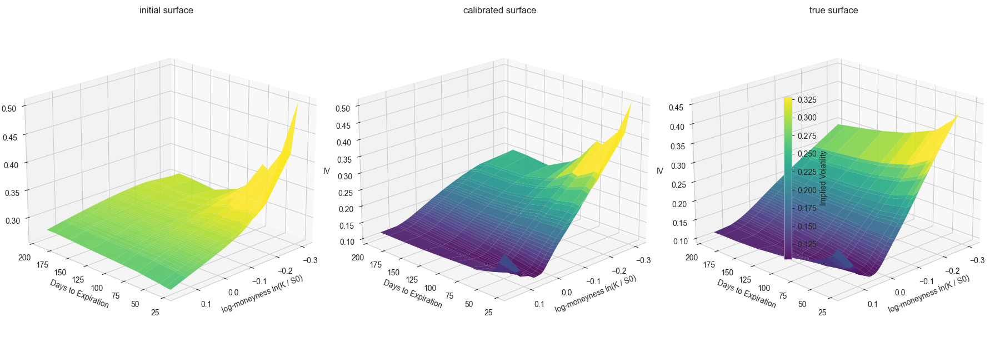

# Heston Model Calibration

This project implements the calibration of the Heston stochastic volatility
model on option market data.

It is based on a paper from the London School of Economics (Full and fast calibration of the Heston
stochastic volatility model - 2017)

The model parameters are estimated by fitting the implied volatility surface
using analytical option pricing and numerical optimization.

## Calibration result

The figure below illustrates the calibration process for SPY options data:
- initial random volatility surface
- calibrated surface obtained after optimization
- target (reference) volatility surface



## Model and methodology

- Heston stochastic volatility model
- Semi-closed form option pricing
- Calibration via least-squares / maximum likelihood
- Exact gradient computation
- Levenberg–Marquardt optimization

## How to run

```bash
python main.py
